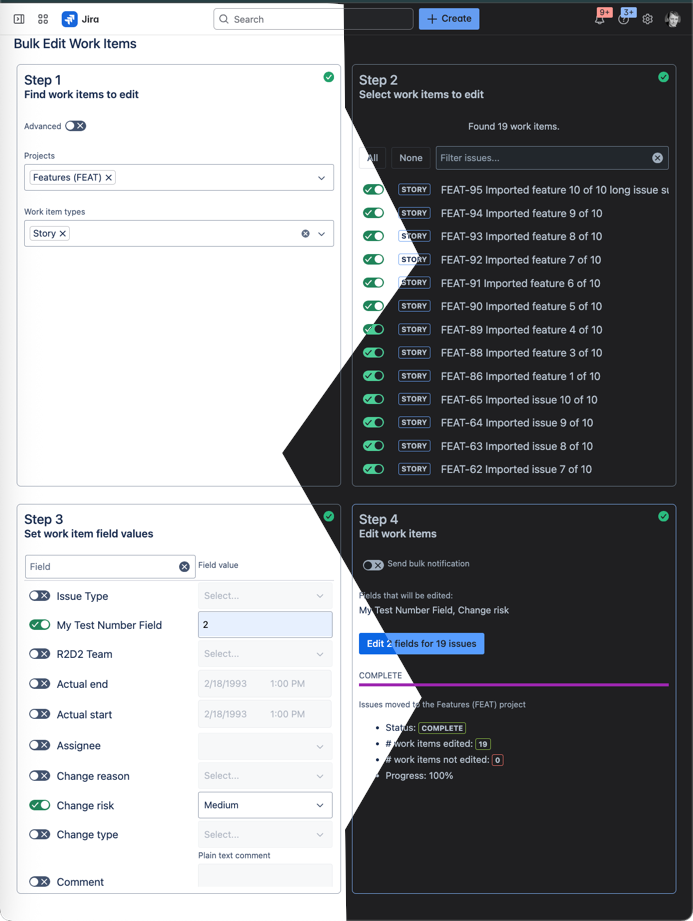

# Forge Bulk Issue Ops

# Introduction

This is a [Forge](https://developer.atlassian.com/platform/forge) app that provides alternate experiences to Jira's built-in functionality to bulk move and edit issues. 

The motivation behind the creation of the app was to constrain bulk work item operations to ensure an organisations practices are adhered to. Specific features of the app include:

* Policy level configuration controlling whether work items can be moved across project category boundaries;
* Ability to include logic specifying the allow target rojects of a move operation based on the selected work items; and
* Ability to include logic to restrict which work item fields are editable.

The following screenshot illustrates the app with its support for rendering in light and dark modes:



# Documentation

* **[Architecture Overview](./documentation/Architecture.md)** - Overview of the major components and system design
* **[Step Completion State Management](./documentation/StepCompletionStateManagement.md)** - Explanation of how workflow step completion is managed
* **[Configuration Instructions](./documentation/configuration-instructions.md)** - Detailed setup guide including environment variables, permissions, and security considerations
* **[Admin Enhancement Exercise](./documentation/admin-enhancement-exercise.md)** - Guide to adding a Jira admin page for configuring bulk operation settings using Forge UI Kit
* **[Managing Bulk Permissions](./documentation/managing-bulk-permissions.md)** - Strategy for dynamic group enrollment to manage bulk operation permissions with basic authentication
* **[Monitoring Enhancement Exercise](./documentation/monitoring-enhancement-exercise.md)** - Implementation guide for monitoring users left in the bulk-ops-app group with automated notifications

## Setup

See [Set up Forge](https://developer.atlassian.com/platform/forge/set-up-forge/) for instructions to get set up.

## Quick Start

```bash
npm install
cd static/spa && npm install && cd ../..
forge deploy
forge install
```

## Configuration

For detailed configuration instructions including environment variables, permissions setup, and security considerations, see [Configuration Instructions](documentation/configuration-instructions.md).


### Development Loop

- Run all forge commands from the `[app-root-directory]`.
- After making changes to the frontend, run `npm run start` from the `[app-root-directory]/static/spa` directory.
- Use the `forge deploy` command when you want to persist code changes or after you make changes to the app manifest.
- Use the `forge install` command when you want to install the app on a new site.
- Once the app is installed on a site, the site picks up the new app changes you deploy without needing to rerun the install command.

You can use the `./scripts/build-and-deploy.sh` to build and deploy the app as per the following examples:

```
./scripts/build-and-deploy.sh
./scripts/build-and-deploy.sh production
```

# Customisation

The app is designed to be support tailoring to an organisation's specific needs, but this requires code changes. There are several public functions in `static/spa/extension/bulkOperationRuleEnforcer.ts` that are designed for orgaisations to inject their own logic. When adding custom logic, it is recommended to keep code within the `static/spa/extension` directory to keep it isolated from the rest of the code.

Static configuration rules are defined as constants in `static/spa/extension/bulkOperationStaticRules.ts`.


# Known issues

Where possible, known issues are documented in the relevant locations in the code. To address the known issues, start by searching the code base for the known issue key.

* KNOWN-1: The deprecated [Get create issue metadata API](https://developer.atlassian.com/cloud/jira/platform/rest/v3/api-group-issues/#api-rest-api-3-issue-createmeta-get) is being used, however, there seems to be no follow through of this deprecation.
* KNOWN-2: The `REMOVE` option is not supported when bulk editing labels.
* KNOWN-3: Labels can not be created within the bulk edit form.
* KNOWN-4: Bulk comment editing only supports plain text where each new line is represented as a new paragraph.
* KNOWN-5: In relation to bulk field editing, not all fields types are supported since each type of field requires custom UI to edit it. 
* KNOWN-6: Rich text fields in bulk move operations only supports plain text where each new line is represented as a new paragraph.
* KNOWN-7: Bulk move operations only allow values to be specified for required custom fields.
* KNOWN-8: Only a limited set of field types are supported for default values in bulk move operations.
* KNOWN-9: Add the ability for issue type mappings to be restricted.
* KNOWN-10: In bulk move, when multiple projects are selected, subsequent steps are still passing.
* KNOWN-11: No monitoring of users accidentally left in the bulk-ops group.
* KNOWN-12: The app does not provide a dark mode view.
* KNOWN-13: No import field filtering.
* KNOWN-14: Import functionality does not surface file format warnings to the user.
* KNOWN-15: All validation is done in the browser which means a user can circumvent the validation. As such, this app should only be used where all potential users are trusted.
* KNOWN-16: Jira allows labels to have odd characters like quotes, new lines, etc, but these exotically encoded labels cause havoc
*           when passing as parameters agaist the REST API.
* KNOWN-17: Inadequate handling of the inability to retrieve an issue subtask.
* KNOWN-18: Should handle the Jira API returning an error when searching for issues.


# Edit field support

As per KNOWN-5, the following identifies the support for bulk editing different types of fields:

Supported:
* issuetype
* com.atlassian.jira.plugin.system.customfieldtypes:float
* com.atlassian.jira.plugin.system.customfieldtypes:select
* reporter
* assignee
* labels
* priority
* text
* comment
* fixVersions
* components
* duedate
* com.atlassian.jira.plugin.system.customfieldtypes:textfield
* com.atlassian.jira.plugin.system.customfieldtypes:datetime
* com.atlassian.jira.plugin.system.customfieldtypes:cascadingselect

The following fields do not support bulk editing, some of which are due to lack of support from Jira (see https://support.atlassian.com/jira-software-cloud/docs/edit-multiple-issues/#Fields-that-can%E2%80%99t-be-bulk-edited), whilst others are due to lack of support from this app:

* com.atlassian.jira.ext.charting:firstresponsedate
* com.atlassian.jira.ext.charting:timeinstatus
* com.atlassian.jira.plugins.service-entity:service-entity-field-cftype
* versions
* com.atlassian.servicedesk.approvals-plugin:sd-approvals
* com.atlassian.jira.plugin.system.customfieldtypes:multigrouppicker
* com.atlassian.jira.plugin.system.customfieldtypes:multiuserpicker
* com.atlassian.jira.plugin.system.customfieldtypes:textarea
* com.atlassian.jira.plugins.jira-development-integration-plugin:designcf
* com.atlassian.jira.plugins.jira-development-integration-plugin:devsummarycf
* environment
* com.pyxis.greenhopper.jira:gh-epic-link
* com.atlassian.jira.plugin.system.customfieldtypes:multicheckboxes
* com.atlassian.jira.plugin.system.customfieldtypes:goals
* com.pyxis.greenhopper.jira:jsw-issue-color
* issuelinks
* com.atlassian.jira.plugins.proforma-managed-fields:forms-locked-field-cftype
* com.atlassian.jira.plugins.proforma-managed-fields:forms-open-field-cftype
* com.atlassian.servicedesk:sd-customer-organizations
* timeoriginalestimate
* com.atlassian.jpo:jpo-custom-field-parent
* com.atlassian.plugins.atlassian-connect-plugin:com.atlassian.atlas.jira__project-key
* com.atlassian.plugins.atlassian-connect-plugin:com.atlassian.atlas.jira__project-status
* com.pyxis.greenhopper.jira:gh-lexo-rank
* com.atlassian.servicedesk.servicedesk-lingo-integration-plugin:sd-request-language
* com.atlassian.servicedesk:sd-request-participants
* com.atlassian.servicedesk:vp-origin
* com.atlassian.servicedesk:sd-request-feedback
* com.atlassian.servicedesk:sd-request-feedback-date
* com.atlassian.servicedesk.sentiment:sd-sentiment
* com.atlassian.jira.plugin.system.customfieldtypes:datepicker
* com.pyxis.greenhopper.jira:jsw-story-points
* com.atlassian.jira.plugins.proforma-managed-fields:forms-submitted-field-cftype
* com.atlassian.jpo:jpo-custom-field-baseline-end
* com.atlassian.jpo:jpo-custom-field-baseline-start
* com.atlassian.jira.plugin.system.customfieldtypes:atlassian-team
* com.atlassian.servicedesk:sd-sla-field
* timetracking
* com.atlassian.jira.plugins.proforma-managed-fields:forms-total-field-cftype
* com.atlassian.jira.plugins.jira-development-integration-plugin:vulnerabilitycf
* com.atlassian.jira.plugins.work-category-field:work-category-field-cftype


